# ESP32 Rover

A wireless two-wheel drive rover controlled in real time via a joystick remote. Both the rover and controller run on ESP32-S3 microcontrollers communicating over ESP-NOW. The rover uses a differential drive model: the joystick directly computes independent wheel speeds rather than issuing directional commands.

Built from scratch as part of a personal electronics and robotics learning roadmap, evolving from a WiFi HTTP browser-controlled Arduino system to a fully ESP32-based real-time differential drive platform over approximately three weeks of first starting electronics.

## Demo

### v2.0: ESP-NOW Joystick Controlled Rover
*Demo GIF coming soon: hardware repair in progress*

### v1.0 / 1.1: WiFi HTTP Rover


## Changelog

### v2.0: Complete hardware and software redesign
**Hardware changes:** 
- Removed Arduino Uno entirely: rover now runs on a single ESP32-S3
- Replaced 4×AA battery pack with 2×18650 Li-ion cells (7.4V nominal)
- Added LM2596 adjustable buck converter for regulated 5V logic power
- Motors powered directly from 18650 pack via TB6612FNG VM pin
- Added physical joystick controller built on a second ESP32-S3

**Software changes:**
- Replaced WiFi HTTP server with ESP-NOW for real-time peer-to-peer wireless control
- Removed Arduino-to-ESP32 UART communication entirely
- Implemented true differential drive: joystick mixer computes independent left/right wheel speeds
- Removed command enum from packet: rover receives raw wheel speeds directly, direction encoded in sign
- Added speed ramping for smooth acceleration and deceleration
- Added battery voltage monitoring, low warning, and hard cutoff protection
- Added 300ms connection timeout safety stop
- Refactored firmware: App_Logic() reduced to clean 8-line orchestration layer

### v1.1
- Added bidirectional UART telemetry: Arduino now sends battery voltage, battery percent, and current gear state to ESP32
- ESP32 web interface displays live rover telemetry with 1 second auto-refresh
- WiFi credentials moved to `secrets.h` (not tracked by git)
- Fixed `Serial1.write()` replacing `Serial1.println()` for cleaner single-byte command transmission

### v1.0
- Initial release: WiFi forward/reverse/stop control via browser
- OLED display showing gear and battery state
- Separated logic and motor power

## Features

### v2.0
- ESP-NOW peer-to-peer wireless: no router, no WiFi network required
- Differential drive mixer: joystick deflection maps directly to independent wheel speeds
- Independent left and right speed ramping for smooth movement
- Real-time battery voltage and percentage on OLED
- Low battery warning and hard cutoff motor protection
- Connection timeout safety: motors stop if no packet received for 300ms
- Motor trim calibration for straight-line driving
- Fully modular firmware architecture
- WiFi HTTP server on ESP32-S3 for wireless browser-based control
- Bidirectional UART communication between ESP32-S3 and Arduino Uno
- Live telemetry streaming: battery voltage, percent, and gear sent from Arduino to ESP32
- I2C OLED display showing drive mode and live battery voltage and percentage
- Dual DC motor control via TB6612FNG H-bridge driver
- Real-time battery voltage monitoring using ADC averaging and voltage divider
- Separated logic power (5V USB power bank) and motor power (4× AA battery pack)
- Modular firmware architecture across dedicated driver files

### v1.0 / 1.1
- WiFi HTTP server on ESP32-S3 for wireless browser-based control
- Bidirectional UART communication between ESP32-S3 and Arduino Uno
- Live telemetry streaming: battery voltage, percent, and gear sent from Arduino to ESP32
- I2C OLED display showing drive mode and live battery voltage and percentage
- Dual DC motor control via TB6612FNG H-bridge driver
- Real-time battery voltage monitoring using ADC averaging and voltage divider
- Separated logic power (5V USB power bank) and motor power (4× AA battery pack)
- Modular firmware architecture across dedicated driver files

## Hardware

### v2.0 Rover
- Freenove ESP32-S3 WROOM-1 N16R8
- TB6612FNG dual motor driver
- 2× TT DC gear motors
- SSD1306 128×64 OLED display (I2C)
- 2× 18650 Li-ion cells (7.4V nominal)
- LM2596 adjustable buck converter (set to output 5V)
- 2WD rover chassis

### v2.0 Controller
- Freenove ESP32-S3 WROOM-1 N16R8
- Analog joystick module
- Powered via USB

### v1.0 / v1.1
- Arduino Uno: main logic controller
- ESP32-S3-WROOM-1 N16R8: WiFi server and wireless interface
- TB6612FNG dual motor driver
- 2× TT DC gear motors
- SSD1306 128×64 OLED display (I2C)
- 4× AA battery holder (motor power)
- 5V USB power bank (logic power)
- 2WD rover chassis
- Breadboard + jumper wires

## System Architecture

### v2.0
```
Joystick (analog X/Y)
        │
        ▼
Controller ESP32-S3
Differential drive mixer
SpeedL = throttle + turn
SpeedR = throttle - turn
        │
        │ ESP-NOW DrivePacket every 50ms
        ▼
Rover ESP32-S3
        │
        ├── App_ProcessNewDrivePacket()
        ├── App_UpdateBattery()
        ├── App_ApplySafetyOverrides()
        ├── App_UpdateMotionRamp()
        │
        ▼
TB6612FNG → Left motor + Right motor
```

### v1.0 / v1.1
```
Browser (phone/PC)
       │
       │ HTTP over WiFi
       ▼
  ESP32-S3
  WiFi HTTP Server
       │                        ▲
       │ UART TX (command)      │ UART RX (telemetry)
       ▼                        │
  Arduino Uno
  App Logic + Motor Control
       │                    │
       ▼                    ▼
TB6612FNG              SSD1306 OLED
Motor Driver           I2C Display
  │      │
Motor A  Motor B
```

## Communication Protocols Used

### v2.0: ESP-NOW
Direct peer-to-peer. No router. Controller sends a `DrivePacket` every 50ms:

```cpp
typedef struct {
  int speedL;
  int speedR;
} DrivePacket;
```
Values range ±2047. Rover maps to ±150 PWM. Sign encodes direction — no command enum needed.

### v1.1: UART Telemetry
Arduino sends structured CSV telemetry to ESP32 every 200ms:

```
T,<voltage>,<percent>,<gear>
```

Example:
```
T,6.62,88.6,D
```

ESP32 parses the packet and displays voltage, battery percent, and current gear on the web control page.

### v1.0: WiFi HTTP + UART Command + I2C
- **WiFi HTTP**: ESP32-S3 hosts a TCP server on port 80. Browser sends GET requests to `/F`, `/R`, or `/S`. ESP32 parses the request line and sends a single character command over UART.
- **UART**: Bidirectional. Single-byte commands (`F`, `R`, `S`) sent from ESP32 TX to Arduino. Structured telemetry packets sent from Arduino TX to ESP32 RX every 200ms.
- **I2C**: OLED display connected to Arduino SDA/SCL via Wire library.

## Differential Drive Mixer (v2.0)

```
throttle = dy   (joystick Y axis deflection from center)
turn     = dx   (joystick X axis deflection from center)

SpeedL = throttle + turn
SpeedR = throttle - turn
```

Straight forward: both wheels equal speed.
Diagonal: outer wheel faster, inner wheel slower — natural arc turn.
Full sideways: wheels spin opposite directions — point turn.
Dead zone of ±250 applied per axis independently before mixing.

## Drive Modes (v1.0 / v1.1)
| Command | Mode | Behavior |
|---------|------|----------|
| F | Drive | Both motors forward at PWM 150 |
| R | Reverse | Both motors reverse at PWM 150 |
| S | Park | Motors stopped |

## Safety Features (v2.0)
| Feature | Behavior |
|---------|----------|
| Connection timeout | Stops motors if no packet received for 300ms |
| Low battery warning | Displays "LOW BATTERY" on OLED below 6.2V |
| Hard cutoff | Forces motors to stop below 6.0V |
| Speed ramping | Prevents abrupt starts and stops |
| Trim calibration | Corrects mechanical motor imbalance for straight driving |

## Power System

### v2.0
```
2× 18650 Li-ion (7.4V nominal)
        │
        ├──────────────────── TB6612FNG VM (motor power, direct)
        │
        └── LM2596 buck converter (adjusted to 5V)
                    │
                    └── ESP32-S3 5V pin (logic power)

All grounds connected together.
```

### v1.0 / v1.1
```
5V USB power bank → Arduino VIN (logic power)
4× AA battery pack → TB6612FNG VM (motor power)
All grounds connected together.
```

## Battery Monitoring

### v2.0
Resistor divider on GPIO10 scales 7.4V battery to 3.3V ADC range.
ESP32-S3 ADC: 12-bit, 0–4095. Vbattery = Vout × 3.2.
Battery percentage mapped between 6.0V (0%) and 8.4V (100%) for 2S 18650 pack.

### v1.0 / v1.1
A voltage divider using two 10kΩ resistors on analog pin A0 halves the battery voltage before it reaches the ADC, keeping it within the Arduino's 0–5V input range. 20 samples are averaged per reading to reduce noise. The firmware doubles the reading back to recover actual battery voltage.

```
Battery+ → R1 → A0 → R2 → GND
Vout = Vbattery × R2 / (R1 + R2)
Vbattery = Vout × 2.0  (for equal R1/R2)
```

Battery percentage is mapped between 4.8V (0%) and 6.85V (100%) for a 4× AA pack.

## Wiring

### v2.0 Rover ESP32 → TB6612FNG
```
GPIO4  → PWMA
GPIO5  → AIN1
GPIO6  → AIN2
GPIO7  → STBY
GPIO15 → BIN1
GPIO16 → BIN2
GPIO17 → PWMB
3.3V   → VCC (logic)
GND    → GND
```

### v2.0 TB6612FNG → Motors
```
AO1, AO2 → Left motor terminals
BO1, BO2 → Right motor terminals
VM       → 7.4V battery positive (direct, no regulation)
```

### v2.0 OLED → Rover ESP32
```
SDA → GPIO8
SCL → GPIO9
VCC → 3.3V
GND → GND
```

### v2.0 Power
```
18650 positive → LM2596 input+
18650 negative → LM2596 input−
LM2596 output+ → ESP32 5V pin
LM2596 output− → GND (shared)
18650 positive → TB6612FNG VM
All GND connected together
```

### v2.0 Battery Monitor
```
Battery positive → resistor divider → GPIO10
Scaled to 3.3V ADC range. Vbattery = Vout × 3.2
```

### v2.0 Controller ESP32 → Joystick
```
GPIO9 → VRx (X axis)
GPIO6 → VRy (Y axis)
3.3V  → VCC
GND   → GND
```

**v1.0 / v1.1 TB6612FNG → Arduino**
```
PWMA  → Pin 9
AIN1  → Pin 7
AIN2  → Pin 6
BIN1  → Pin 4
BIN2  → Pin 3
PWMB  → Pin 10
STBY  → Pin 8
```

**v1.0 / v1.1 TB6612FNG → Motors**
```
AO1, AO2 → Motor A terminals
BO1, BO2 → Motor B terminals
VM       → 4× AA battery pack positive
GND      → shared ground
```

**v1.0 / v1.1 Motors → TB6612FNG**
```
Motor terminal holes → jumper wire pins bent through and connected to AO1/AO2 and BO1/BO2
(prototype connection: solder directly to motor tabs for permanent builds)
```

**v1.0 / v1.1 OLED → Arduino**
```
SDA → A4
SCL → A5
VCC → 5V
GND → GND
```

**v1.0 / v1.1 ESP32-S3 ↔ Arduino UART**
```
ESP32 GPIO17 (TX) → Arduino pin 12 (SoftwareSerial RX)
Commands: ESP32 → Arduino (3.3V signal, Arduino 5V tolerant: no level shift needed)

Arduino pin 11 (SoftwareSerial TX) → voltage divider → ESP32 GPIO16 (RX)
Telemetry: Arduino → ESP32 (5V signal divided to 3.3V for ESP32 input protection)

Voltage divider: R1 = 10kΩ, R2 = 20kΩ
Vout = 5V × 20k / (10k + 20k) = 3.33V

Shared GND
```

**v1.0 / v1.1 Battery Monitor**
```
Battery+ → voltage divider → A0
Divider: two equal resistors to GND
```

**v1.0 / v1.1 Power**
```
Logic power:  5V USB power bank → Arduino VIN
Motor power:  4× AA pack → TB6612FNG VM
Shared GND across all components
```

## Firmware Structure

### v2.0
```
rover/
├── main.ino
├── app_logic.h / .cpp       — orchestration, battery, safety, ramping
├── motor_driver.h / .cpp    — TB6612FNG control
├── OLED_driver.h / .cpp     — SSD1306 display abstraction
└── espnow_driver.h / .cpp   — ESP-NOW receive, packet parsing

controller/
├── controller.ino           — joystick read, mixer, ESP-NOW send
└── joystick_driver.h / .cpp — analog joystick abstraction
```

### v1.0 / v1.1
```
arduino/
├── main.ino
├── app_logic.h / .cpp       — motor control, battery, telemetry
├── motor_driver.h / .cpp    — TB6612FNG control
├── OLED_driver.h / .cpp     — SSD1306 display abstraction
└── button_driver.h / .cpp   — debounced button input

esp32_wifi_server/
└── esp32_wifi_server.ino    — WiFi HTTP server, UART command send, telemetry parse
```


## Known Limitations

### v2.0
- No encoder feedback — wheel speeds are open loop, actual speed varies with load and battery voltage
- OLED redraws every loop — minor flicker under fast update rates
- ESP-NOW has no acknowledgement retry: occasional dropped packets possible under interference
- Controller powered via USB only: not yet battery powered for fully untethered operation

### v1.0 / v1.1
- **HTTP server blocks during client handling**: `readStringUntil()` blocks the ESP32 loop while reading the HTTP request. Commands cannot be received during this window. An async HTTP server would resolve this.
- **SoftwareSerial**: software UART emulation on Arduino pins 11/12 can miss bytes under interrupt load. Hardware UART on pins 0/1 would be more reliable but conflicts with USB serial during development.
- **OLED redraws every loop**: display is cleared and redrawn on every iteration causing minor flicker. Redrawing only on state change would improve this.

## Future Improvements
- Add wheel encoders for closed-loop speed control
- Battery power the controller for full untethered operation
- Add IMU for orientation feedback and stabilization
- Add autonomous obstacle avoidance with ultrasonic sensor
- Migrate to ROS 2 for full robotics stack integration
- Add onboard camera for FPV view

## Build Photos

### v2.0 — ESP-NOW Joystick Controlled Rover
*Demo GIF coming soon — hardware repair in progress*

#### Rover
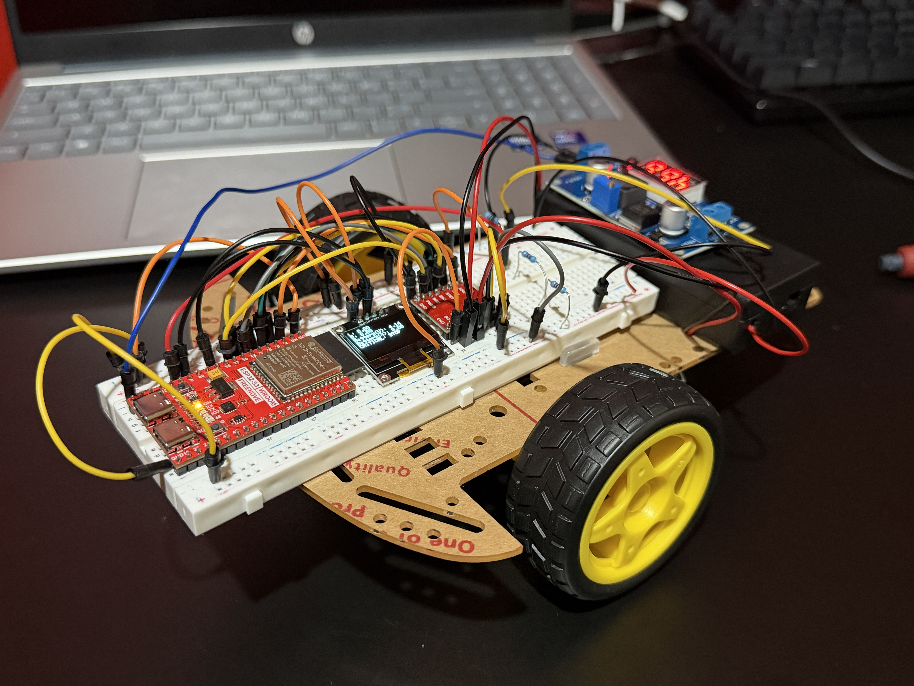

#### Rover top view
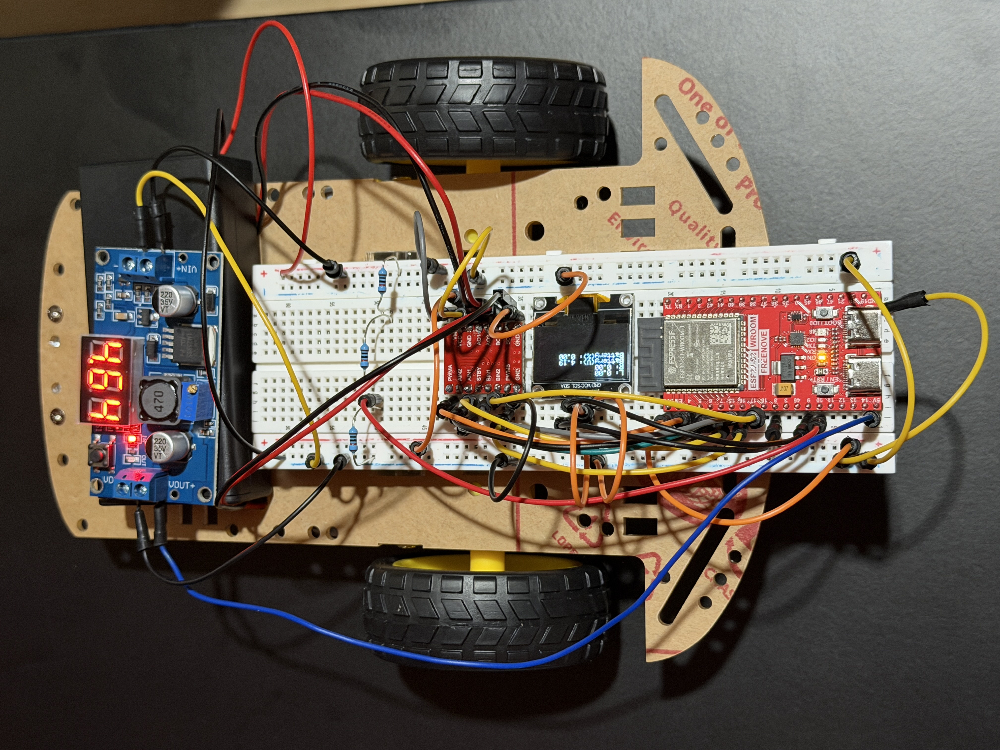

#### Controller
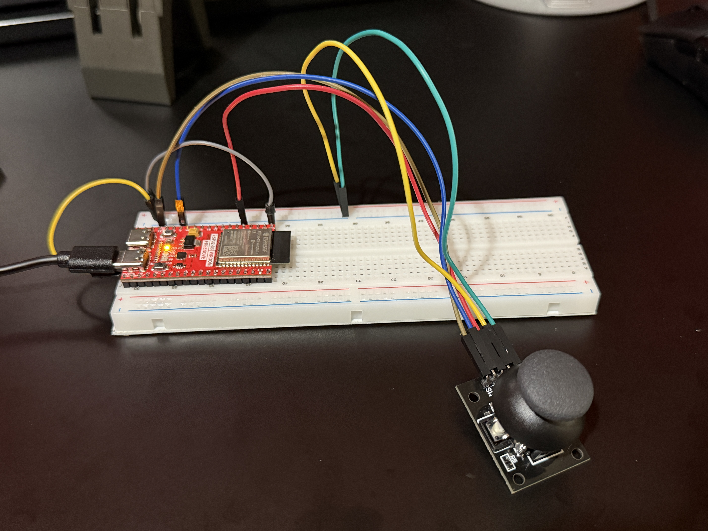

#### Power system: LM2596 buck converter + 18650 cell holder
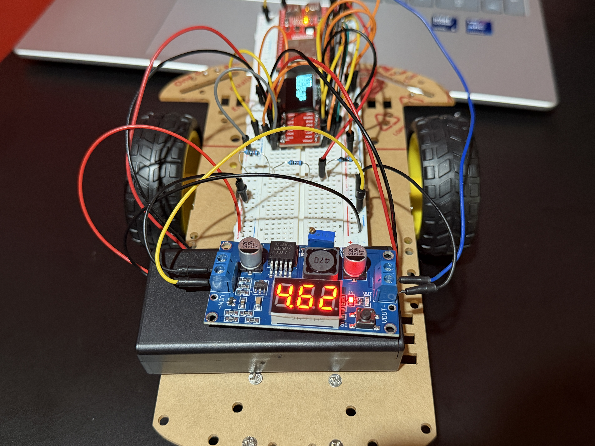

#### Power system: 18650 cells
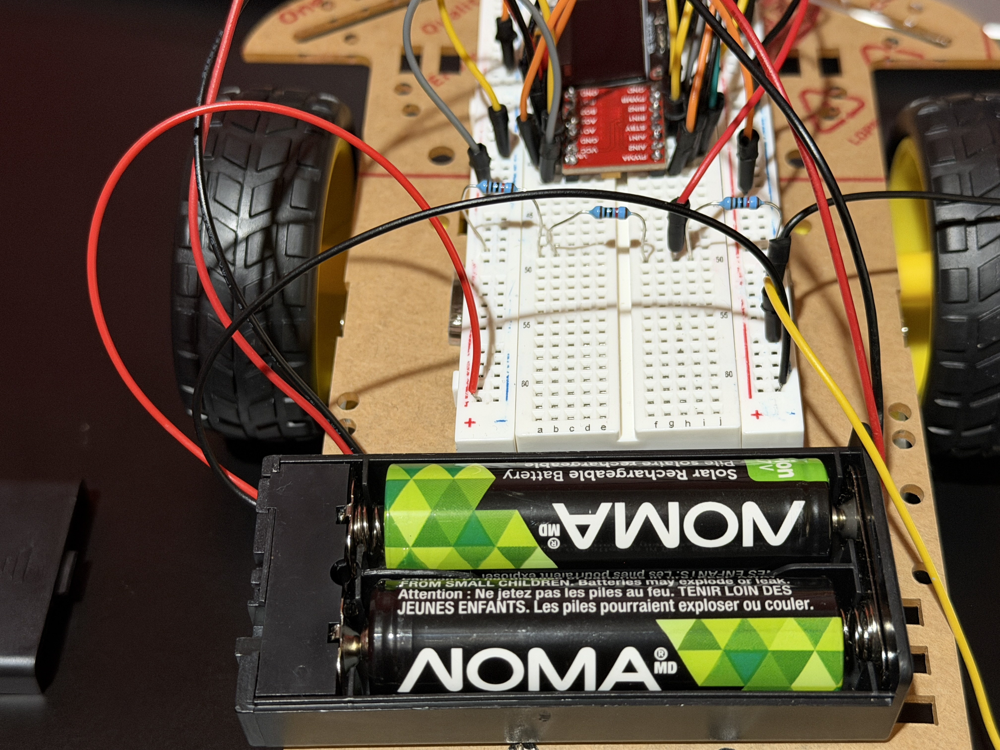

#### OLED display
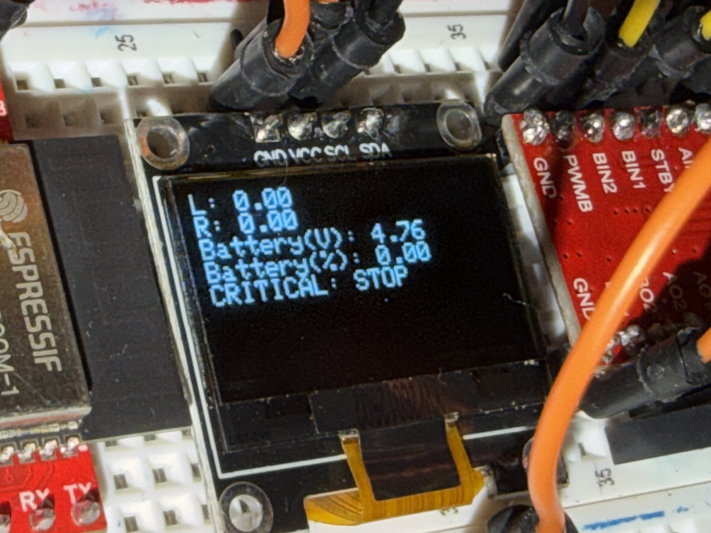

#### Chassis underside


---

### v1.0 / v1.1 — WiFi HTTP Arduino + ESP32 Rover

#### UART level shifter: voltage divider on Arduino TX to ESP32 RX
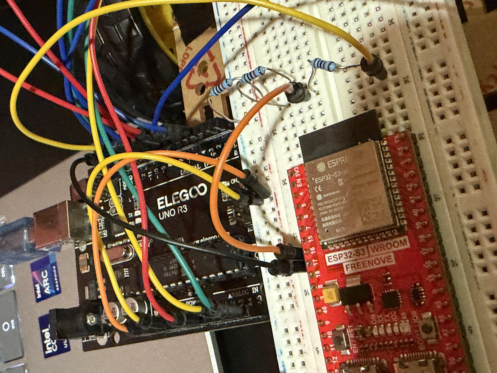

#### Full rover: top view
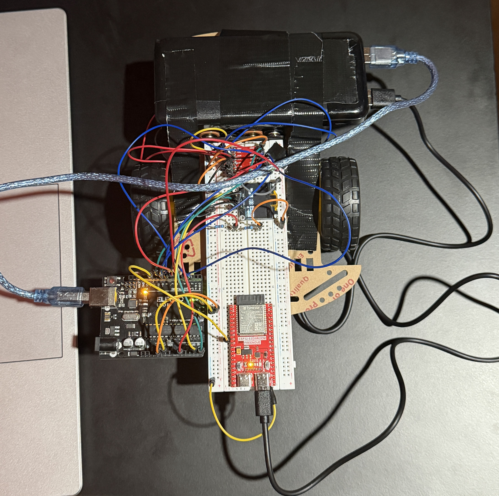

#### Rover on desk


#### Arduino Uno + ESP32-S3 close-up
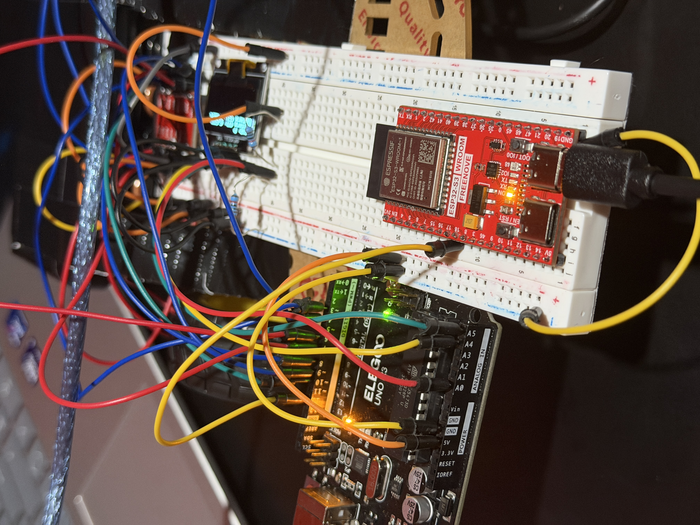

#### Wiring and TB6612FNG motor driver
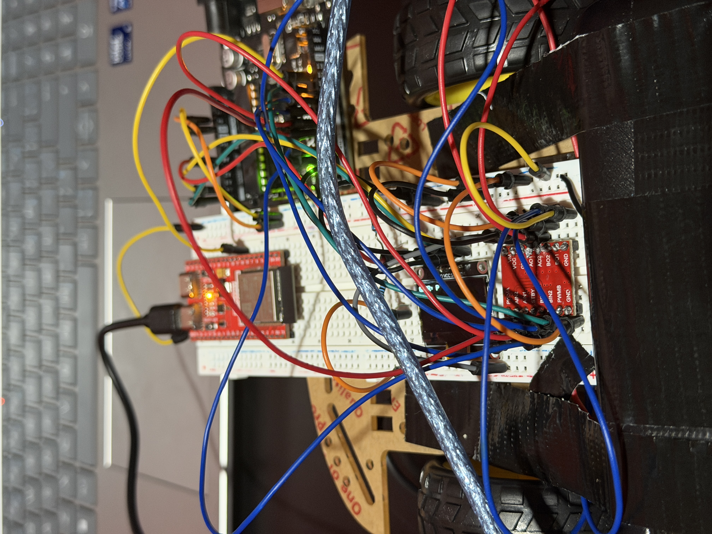

#### OLED display showing live battery and gear state
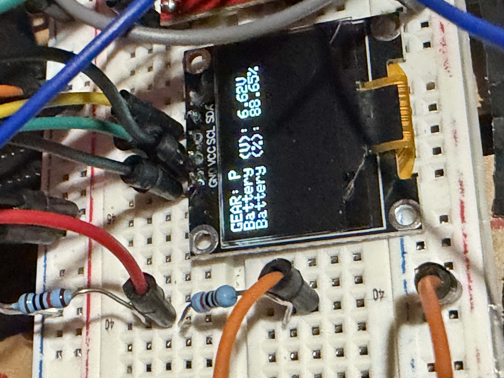

#### Underside: motors and chassis


#### Motor wire routing
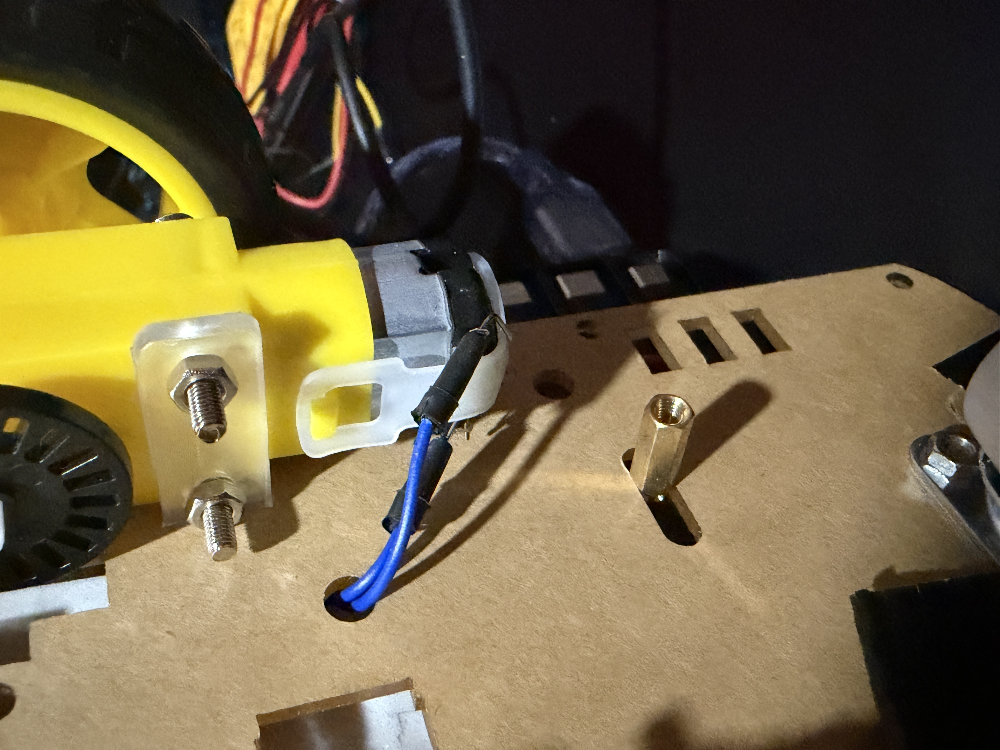

#### Motor battery pack: 4× AA Duracell


## Notes
Started as a WiFi HTTP browser-controlled rover with an Arduino Uno and ESP32-S3, evolved through bidirectional UART telemetry, and redesigned entirely in v2.0 into a fully ESP32-based differential drive platform with real-time ESP-NOW joystick control and a proper lithium cell power system. Built approximately three weeks after opening a beginner electronics kit for the first time.
